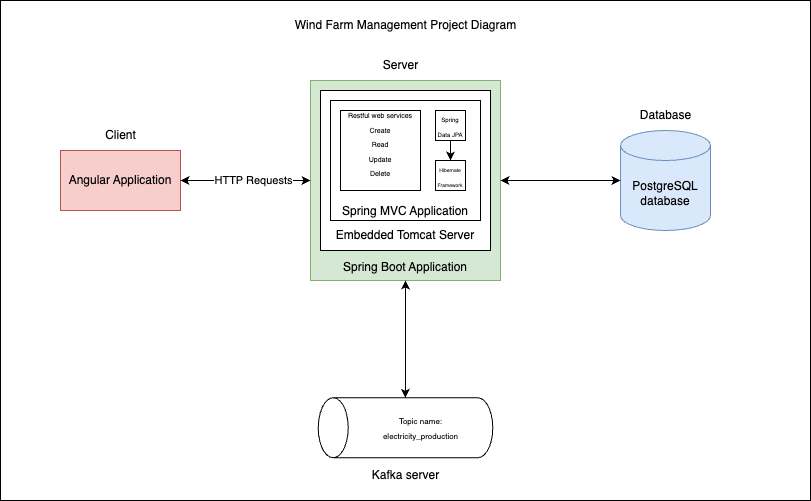
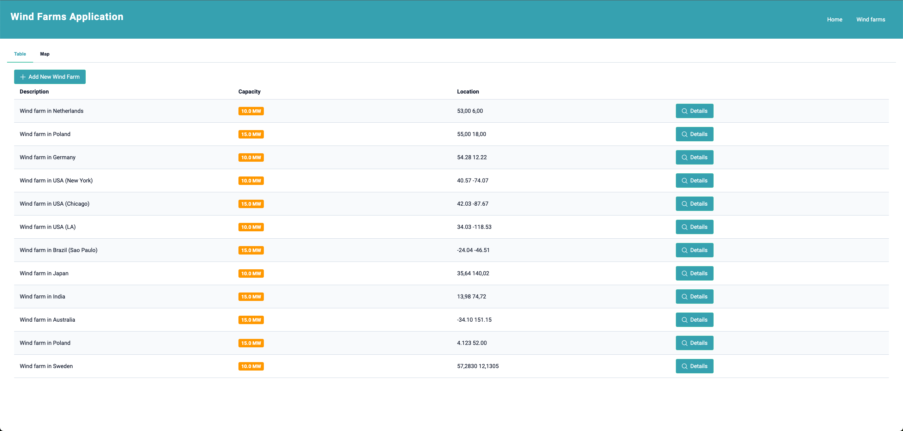
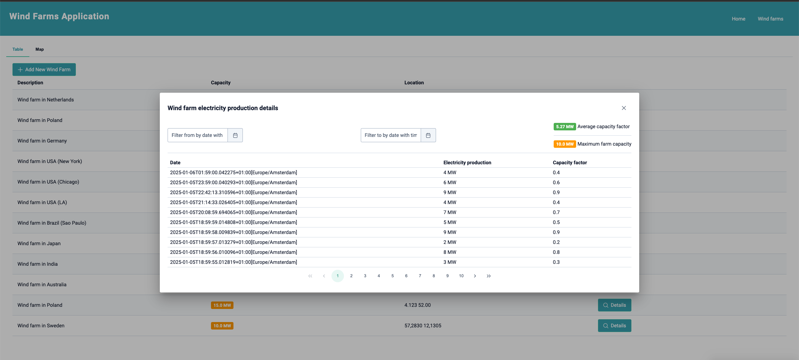
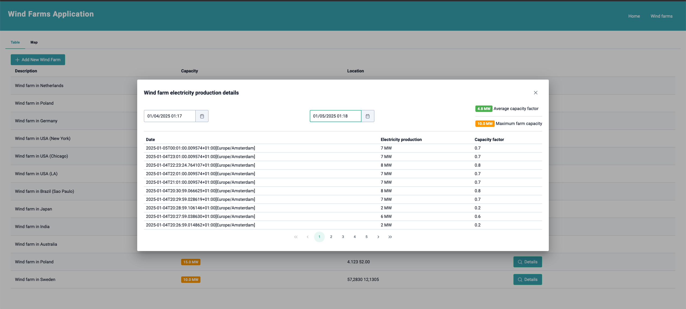
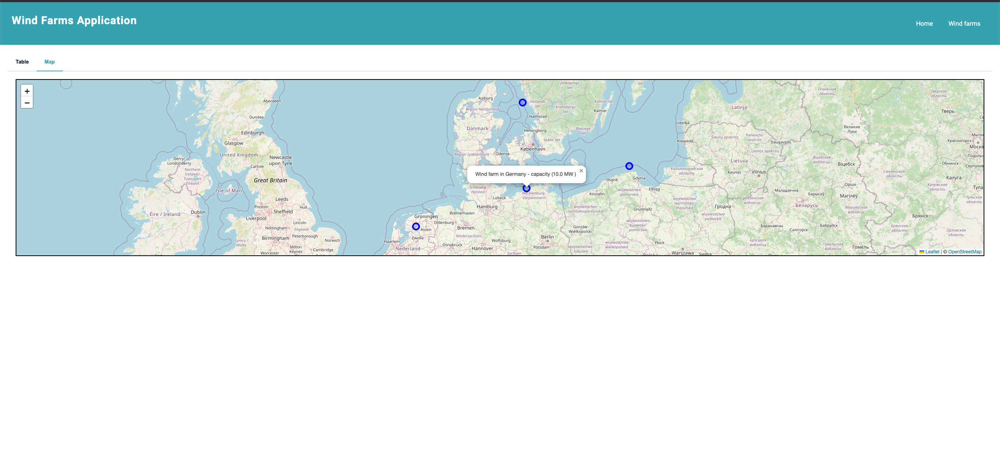

# Wind Farm Management Project


## Overview
The Wind Farm Management Project is a system designed to monitor and manage wind farms efficiently. It consists of two primary components:

1. **Backend**: A Spring Boot application for managing business logic and data processing.
2. **Frontend**: An Angular application for an intuitive user interface to interact with the system.

The project uses **PostgreSQL** as its database for storing wind farm data and supports features like electricity production analysis and time zone handling.

## Features
- REST API documentation with **Swagger**.
- Swagger UI available locally at: [http://localhost:8080/api/swagger-ui/index.html#/](http://localhost:8080/api/swagger-ui/index.html#/)
- JavaDocs are committed to the repository for backend code.
- User-friendly interface for visualizing and managing wind farm data.

## Prerequisites
- **Java**: JDK 17 or higher
- **Node.js**: Version 16 or higher
- **Angular CLI**: Installed globally
- **PostgreSQL**: Running instance with a configured database

---

## Diagram



---

## Screenshots from application






## Backend (Spring Boot Application)

### Build and Run

1. **Clone the Repository**:
   ```bash
   git clone https://github.com/your-repository.git
   cd wind-farm-service
   ```

2. **Configure Database**:
   Update the `application.properties` or `application.yml` file with your PostgreSQL credentials:
   ```properties
   spring.datasource.url=jdbc:postgresql://localhost:5432/your_database
   spring.datasource.username=your_username
   spring.datasource.password=your_password
   ```

3. **Build the Application**:
   ```bash
   ./mvnw clean install
   ```

4. **Run the Application**:
   ```bash
   java -jar target/wind-farm-backend-0.0.1-SNAPSHOT.jar
   ```

5. **Access the API**:
   Swagger UI will be available at [http://localhost:8080/api/swagger-ui/index.html#/](http://localhost:8080/api/swagger-ui/index.html#/).

---

## Frontend (Angular Application)

### Build and Run

1. **Navigate to the Angular Project**:
   ```bash
   cd wind-farm-ui
   ```

2. **Install Dependencies**:
   ```bash
   npm install
   ```

3. **Run the Application**:
   ```bash
   ng serve
   ```

4. **Access the Application**:
   Open your browser and navigate to [http://localhost:4200/](http://localhost:4200/).

---

## Deployment

To deploy the backend and frontend applications, containerization with Docker or cloud services like AWS, Azure, or GCP can be used. Detailed deployment instructions can be found in the respective deployment guides.

## Contributing

Contributions are welcome! Please follow the standard fork-and-pull request workflow.

1. Fork the repository
2. Create a feature branch
3. Commit your changes
4. Push to your branch
5. Create a pull request

---

## License
This project is licensed under the MIT License. See the `LICENSE` file for details.

